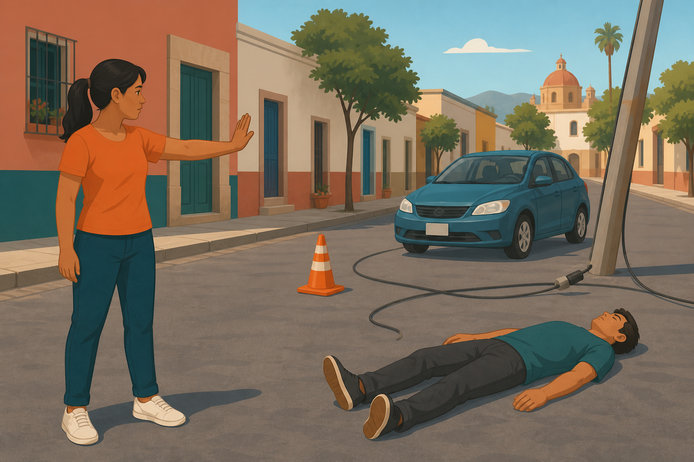
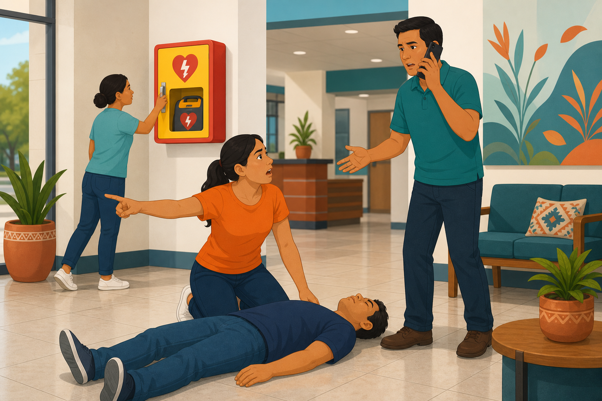
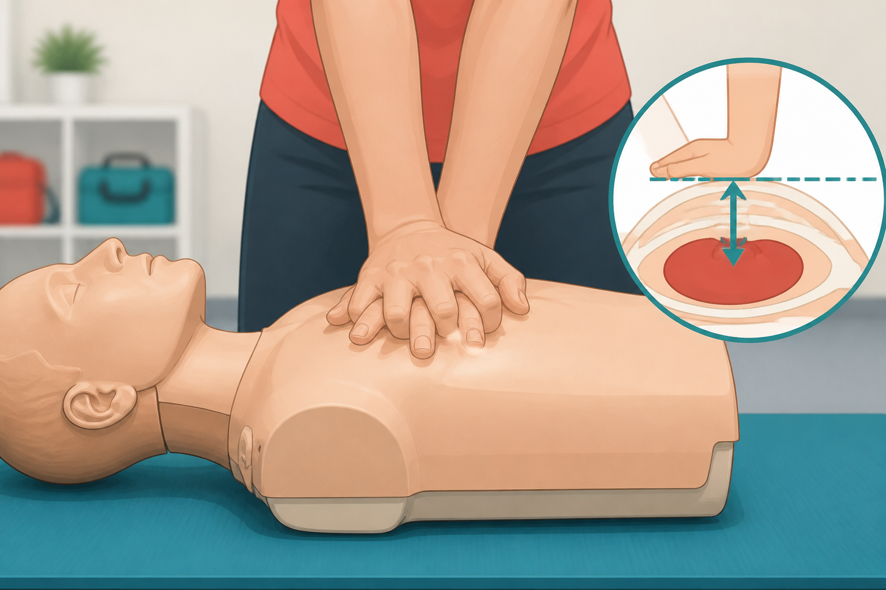
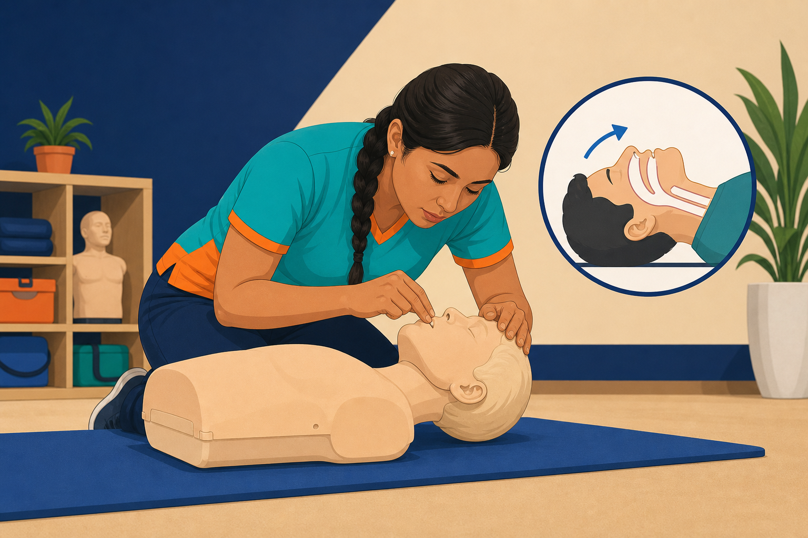
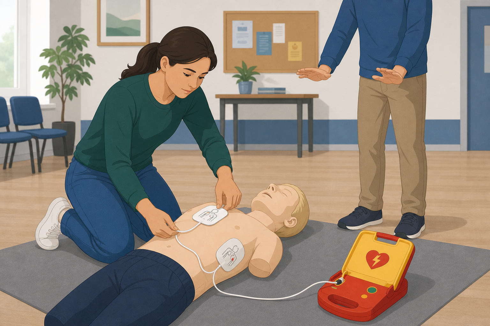
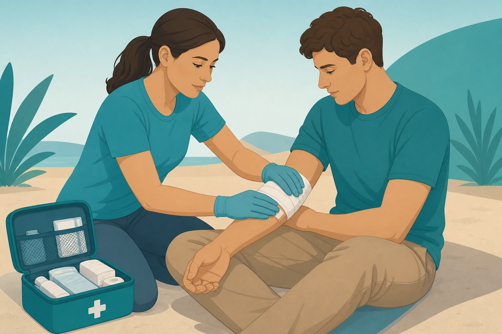

# Red de Ayuda

<p align="center">
  
</p>

**Red de Ayuda** es una app de emergencia para Android que forma una red entre teléfonos por **Bluetooth**, sin internet y sin saldo. Si alguien pide ayuda (SOS), el aviso puede saltar de teléfono en teléfono hasta llegar a un rescatista.

> Prototipo educativo. No sustituye a Protección Civil ni a un curso oficial de primeros auxilios.

---

## Qué hace

| Función | Descripción |
|---------|-------------|
| **SOS** | Pides ayuda; tu teléfono envía un aviso cifrado por BLE. |
| **Ayudar en silencio** | Sin abrir nada especial, tu teléfono puede retransmitir mensajes de otros. |
| **Rescatista** | Ves SOS cercanos y puedes contactar o hacer sonar el teléfono de la víctima. |
| **Guías** | Temblor, inundación y RCP / primeros auxilios con pasos ilustrados. |
| **Notificaciones** | «Activando SOS» o «Ayudando a compartir mensaje», con acciones rápidas. |

---

## Cómo funciona (pasos)

### 1. Instálala y ya estás ayudando

Con solo tener la app, tu teléfono puede convertirse en un puente silencioso.


### 2. Sin internet. Sin saldo. Sin antenas

Cuando cae la red celular, los teléfonos se hablan por Bluetooth y el aviso salta de uno a otro.


### 3. Si necesitas ayuda, pulsa SOS

Los vecinos no ven tus datos: solo pasan un mensaje cerrado hasta quien puede ayudar.


### 4. El mensaje viaja de teléfono en teléfono

Así funciona la cadena cuando pediste ayuda:


### 5. Guías en la app

| Temblor | Inundación | RCP y primeros auxilios |
|---------|------------|-------------------------|
|  |  |  |

### 6. Primeros auxilios — elige el problema

En **RCP y primeros auxilios** hay un submenú «¿Qué hacer?» con paso a paso e imágenes por caso:

| Caso | Vista |
|------|--------|
| Escena segura |  |
| Revisar respuesta / respiración |  |
| Llamar al 911 y DEA |  |
| Compresiones |  |
| Ventilaciones |  |
| Usar DEA |  |
| Posición lateral |  |
| Hemorragia |  |
| Lesión de cuello |  |
| Atragantamiento |  |

---

## Pantalla principal


- Activa **Bluetooth** para ayudar.
- Botón grande **SOS**.
- Guías, repetidor silencioso y modo rescatista.
- Pie de página: **Hecho por Cristhian Ceballos · Ceballosleon.com** (abre el sitio al tocarlo).

---

## Requisitos

- Android 8.0+ (API 26)
- Bluetooth LE
- JDK 17 para compilar

## Cómo compilar

```bat
cd android
set JAVA_HOME=..\ .tools\jdk-17.0.20+8
gradlew.bat :app:assembleDebug
```

APK: `android/app/build/outputs/apk/debug/app-debug.apk`

Tests y simulador de nodos:

```bat
cd android
run-tests.bat
gradlew.bat :simulator:run
```

## Estructura del proyecto

```
docs/                 Arquitectura, protocolo, imágenes del README
protocol/             Test vectors hex EmergencyPacket v1
android/              App Kotlin (domain, data, transport-ble, platform, app)
ios/                  Spec / skeleton (no compilable en Windows)
simulator/            Simulador de mesh en memoria
```

Documentación técnica: [`docs/README.md`](docs/README.md)

## Estado

| Fase | Qué | Estado |
|------|-----|--------|
| Arquitectura y protocolo | Docs 1–16 | Hecho |
| Núcleo JVM + tests + simulador | A→B→C→D | PASS |
| App Android | UI, SOS, guías, notificaciones | MVP listo |
| Prueba de campo 3 teléfonos | BLE real | Pendiente de hardware |
| iOS / Wi-Fi / LoRa | Futuro | Spec |

---

## Autor

**Hecho por Cristhian Ceballos**  
Firma y sitio: **[Ceballosleon.com](https://ceballosleon.com)**

---

## Aviso legal

Prototipo de investigación / educación. No es un sistema certificado de protección civil.  
No afirma integración oficial con SASMEX.
