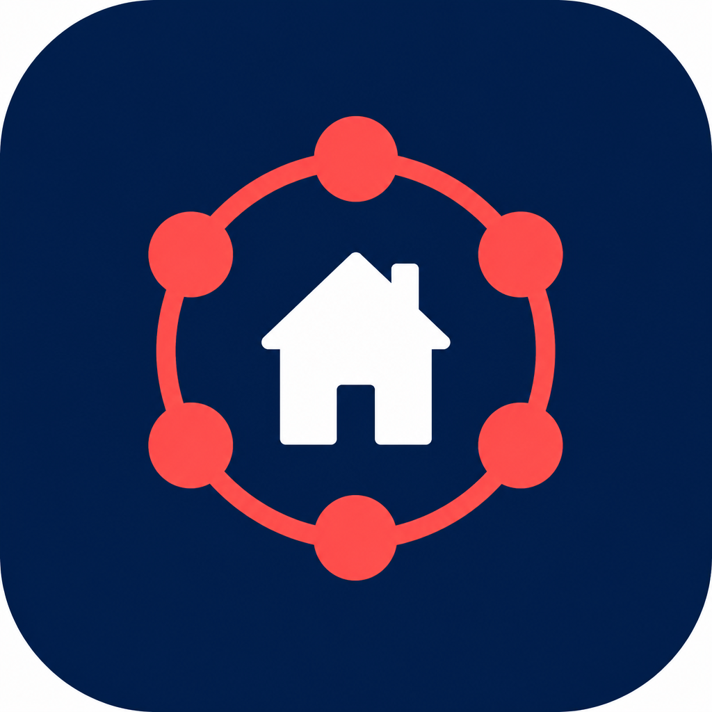
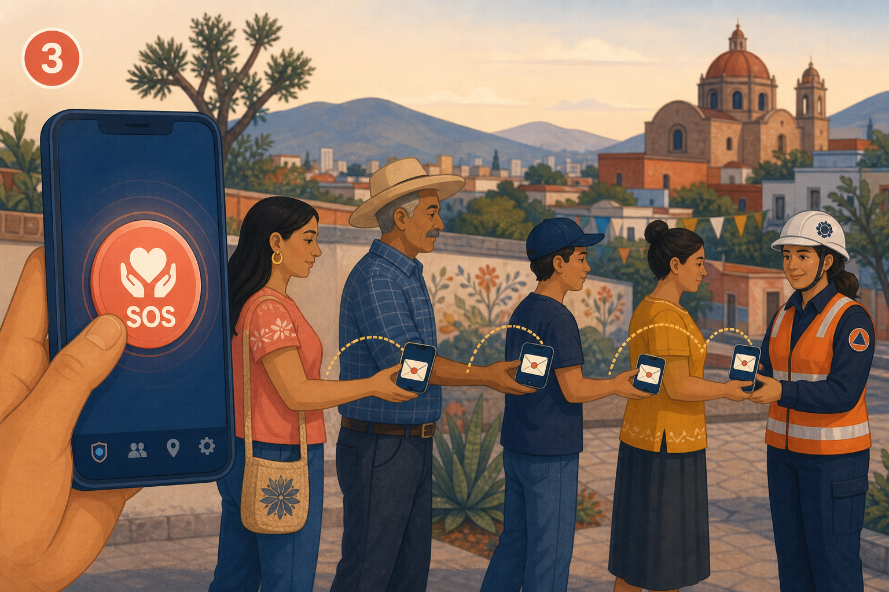
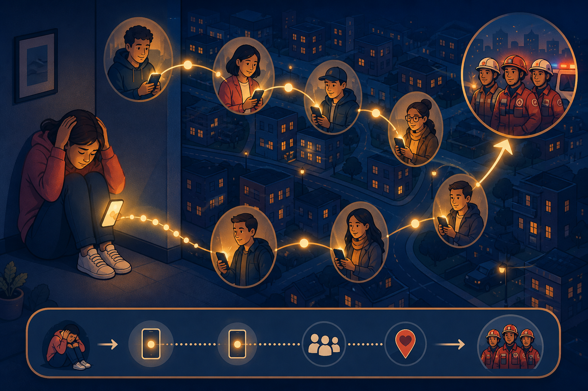
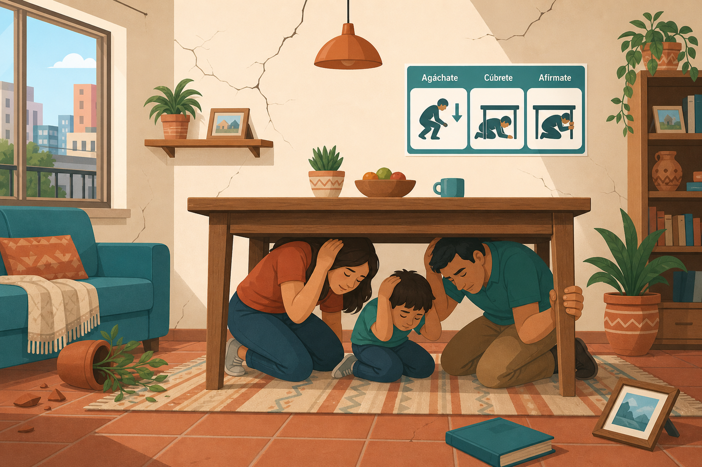
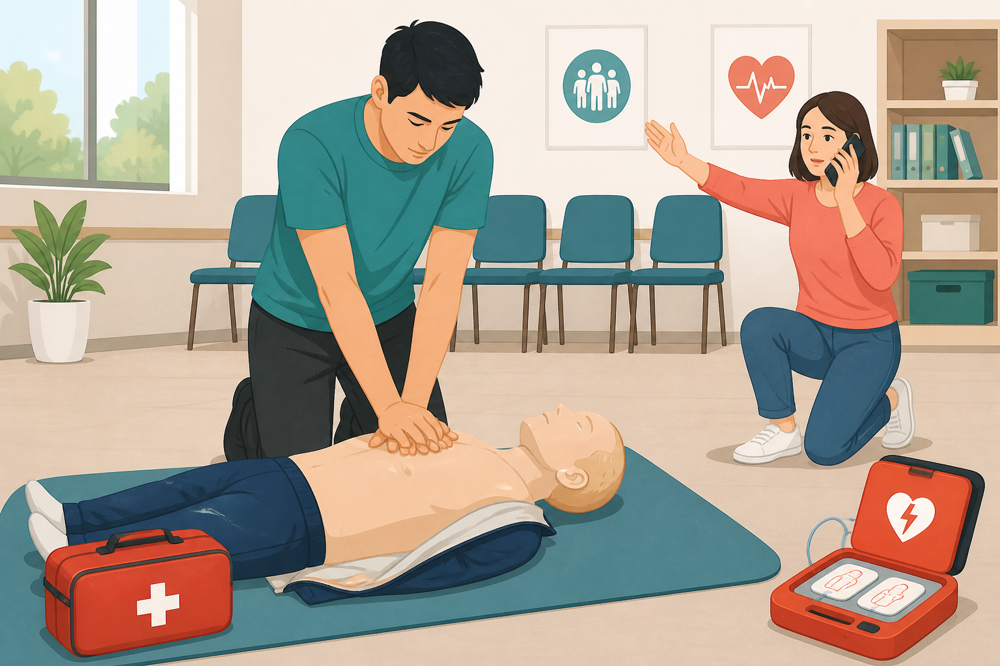

# Red de Ayuda

<p align="center">
  
</p>

**Red de Ayuda** es una app de emergencia para Android que forma una red entre teléfonos por **Bluetooth** (y **Wi‑Fi Direct** si el teléfono lo soporta), sin depender de internet ni de antenas celulares. Si alguien pide ayuda (SOS), el aviso puede saltar de teléfono en teléfono hasta llegar a un rescatista. Además puede avisar a tu **red de contactos por SMS** cuando hay saldo.

> Versión actual de la app: **0.3.2** · Prototipo educativo. No sustituye a Protección Civil ni a un curso oficial de primeros auxilios.

---

## Qué hace la aplicación

| Función | Descripción |
|---------|-------------|
| **SOS** | Pides ayuda; se crea un mensaje de emergencia en la mesh (BLE + Wi‑Fi Direct si aplica). |
| **GPS en vivo** | Con SOS activo, la ubicación se actualiza y se reenvía por la mesh (`LOCATION_UPDATE` ~cada 30 s o al moverte). |
| **Red de contactos** | Hasta **5** teléfonos de la agenda; en SOS se envía **SMS** con enlace a Maps **cada 5 minutos**. |
| **Ayudar en silencio** | Modo repetidor: tu teléfono retransmite SOS sin mostrar datos de nadie. |
| **Soy rescatista** | Ves SOS recibidos, distancia a la víctima, contactar / hacer sonar el teléfono. |
| **Buscador** | Mapa y distancia en vivo (Google Maps con API key, o OpenStreetMap sin key). |
| **Guías** | Temblor, inundación y RCP / primeros auxilios con pasos e imágenes. |
| **Estado visible** | Chips en el inicio: red, Bluetooth, Wi‑Fi Direct, Internet, contactos. |
| **Notificaciones** | «Activando SOS» o «Ayudando a compartir mensaje», con «Estoy bien» y «Cerrar aplicación». |
| **Onboarding** | 5 pasos: idea de la mesh, permisos y agregar contactos de confianza. |

---

## Cómo funciona (pasos)

### 1. Instálala y ya estás ayudando

Con solo tener la app, tu teléfono puede convertirse en un puente silencioso.


### 2. Sin internet. Sin saldo. Sin antenas

Cuando cae la red celular, los teléfonos se hablan por Bluetooth (y Wi‑Fi Direct si está disponible). El aviso salta de uno a otro.


### 3. Si necesitas ayuda, pulsa SOS

Los vecinos no ven tus datos: solo pasan un mensaje cerrado hasta quien puede ayudar. Si configuraste contactos y hay saldo, también salen SMS con tu ubicación.



### 4. El mensaje viaja de teléfono en teléfono

Así funciona la cadena cuando pediste ayuda:



### 5. Guías en la app

| Temblor | Inundación | RCP y primeros auxilios |
|---------|------------|-------------------------|
|  |  |  |

---

## Pantalla principal


- **Chips de estado:** red (inactiva / activa / SOS / rescatista), Bluetooth, Wi‑Fi Direct, Internet, contactos `n/5`.
- **Bluetooth:** tarjeta para activarlo; al abrir la app se puede pedir encenderlo; al confirmar SOS se intenta activar si hace falta.
- **Red de contactos:** tarjeta para elegir hasta 5 números de la agenda.
- **Botón grande SOS:** confirma, arranca mesh, GPS en vivo y SMS a contactos.
- **Guías:** temblor, inundación, RCP y primeros auxilios.
- **Ayudar en silencio** y **Soy rescatista**.
- **Pie:** Hecho por Cristhian Ceballos · [Ceballosleon.com](https://ceballosleon.com).

---

## SOS en detalle

Al activar SOS:

1. Arranca la mesh (**BLE** + **Wi‑Fi Direct** si el teléfono lo soporta).
2. Se crea el paquete de emergencia con batería y ubicación.
3. **GPS en vivo:** actualizaciones periódicas y `LOCATION_UPDATE` en la mesh.
4. **SMS** a tus contactos (inmediato y cada 5 min mientras el SOS siga activo), con enlace a Maps.

### Franja roja (puedes seguir usando la app)

- Estado del mensaje en la red (viaja / llegó / rescatistas cerca).
- **Estoy aquí** — avisa por la mesh que sigues en el lugar.
- **Estoy bien** — cancela el SOS, detiene SMS y GPS en vivo, oculta la franja.

### Notificación persistente

- En SOS: «Activando SOS» + acción **Estoy bien**.
- En mesh normal: «Ayudando a compartir mensaje» + **Cerrar aplicación**.

---

## Red de contactos

- Hasta **5** teléfonos desde la agenda (permisos de contactos y SMS).
- Se configuran en onboarding (pasos 4–5) o en la tarjeta del inicio.
- En SOS: SMS automático con ubicación; **no** usa WhatsApp.

---

## Onboarding (primera vez)

1. Instálala y ya estás ayudando  
2. Sin internet / sin saldo / sin antenas  
3. Si necesitas ayuda, pulsa SOS  
4. **Permisos** (ubicación, contactos, SMS, Bluetooth, notificaciones…)  
5. **Agrega 2–3 contactos de confianza** (opcional, se puede completar después)

---

## Guías y primeros auxilios

**Guías de texto:** Temblor · Inundación.

**RCP y primeros auxilios** — submenú «¿Qué hacer?» con pasos e imágenes:

- Antes de ayudar (escena segura)  
- No responde y no respira (RCP)  
- Usar un DEA  
- Se atraganta  
- Sangrado fuerte  
- Inconsciente pero respira (posición lateral)  
- Sospecha de lesión en cuello  

---

## Modo rescatista y Buscador

Solo para personal autorizado en un despliegue real.

- Lista de SOS recibidos por la mesh (id corto, hops, batería, coordenadas).
- **Distancia en vivo** entre tú y la víctima.
- **Contactar** / **Hacer sonar** el teléfono de la víctima (ping por mesh).
- **Buscar en mapa:**
  - Con `MAPS_API_KEY` → Google Maps nativo.
  - Sin clave → OpenStreetMap (WebView).
  - Botón para abrir navegación en la app de Google Maps.
- Las actualizaciones `LOCATION_UPDATE` de la víctima se fusionan con su SOS (una ficha por origen).

---

## Requisitos

- Android **8.0+** (API 26)
- Bluetooth LE
- (Opcional) Wi‑Fi Direct, SMS/saldo, internet para el mapa del Buscador
- JDK **17** para compilar

## Cómo compilar

```bat
cd android
set JAVA_HOME=..\ .tools\jdk-17.0.20+8
gradlew.bat :app:assembleDebug
```

APK: `android/app/build/outputs/apk/debug/app-debug.apk`

### Clave de Google Maps (solo Buscador / rescatistas)

La clave **no va en el código ni en Git**. En `android/local.properties` (ignorado por Git):

```properties
MAPS_API_KEY=AIza...tu_clave...
```

Plantilla: `android/local.properties.example`.

En [Google Cloud Console](https://console.cloud.google.com/): habilita **Maps SDK for Android**, crea la clave y restrínjela al paquete `mx.reddeayuda.app` + SHA-1 de tu keystore (debug o release).

Sin clave, el Buscador usa OpenStreetMap; la distancia en vivo funciona igual.

Tests y simulador:

```bat
cd android
run-tests.bat
gradlew.bat :simulator:run
```

## Estructura del proyecto

```
docs/                 Arquitectura, protocolo, imágenes del README
protocol/             Test vectors hex EmergencyPacket v1
android/              App Kotlin (domain, data, transport-ble, transport-wifi, platform, app)
ios/                  Spec / skeleton (no compilable en Windows)
simulator/            Simulador de mesh en memoria
```

Documentación técnica: [`docs/README.md`](docs/README.md) · Cambios: [`CHANGELOG.md`](CHANGELOG.md)

## Estado

| Fase | Qué | Estado |
|------|-----|--------|
| Arquitectura y protocolo | Docs 1–16 | Hecho |
| Núcleo JVM + tests + simulador | A→B→C→D | PASS |
| App Android | SOS, mesh, contactos, GPS, Buscador, guías | MVP 0.3.2 |
| Prueba de campo 3 teléfonos | BLE real | Pendiente de hardware |
| iOS / LoRa | Futuro | Spec |

---

## Autor

**Hecho por Cristhian Ceballos**  
Firma y sitio: **[Ceballosleon.com](https://ceballosleon.com)**

---

## Aviso legal

Prototipo de investigación / educación. No es un sistema certificado de protección civil.  
No afirma integración oficial con SASMEX.
